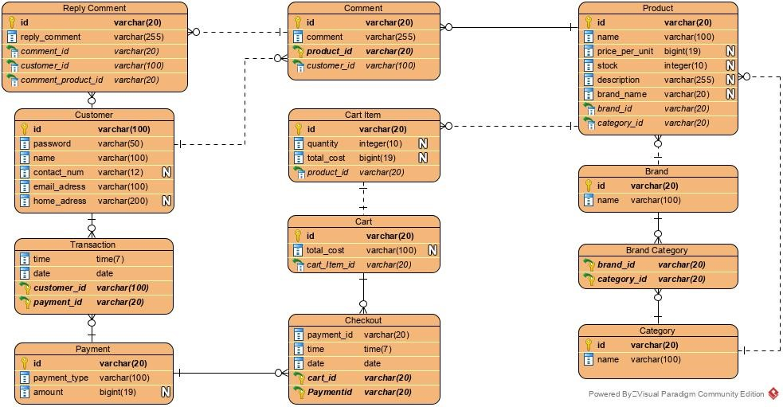

# 20-01-tokepedia
Repository ini digunakan untuk menyimpan artefak proyek mata kuliah 12S3101 Pemrograman dan Pengujian Aplikasi Web di Institut Teknologi Del.  Topik: Tokepedia Computer and Accessories

## Tokepedia
Tokepedia adalah sebuah toko komputer dan aksesoris komputer yang kurang terkenal. Sang pemilik, Pill Gates, memiliki visi untuk mempublikasikan toko-nya melalui media Internet sehingga dapat bersaing dan meraup untung. 

## Struktur Kerja
Berikut adalah rancangan kerja aplikasi Tokepedia yang dibangun dengan python dan menggunakan Django Framework.

## Struktur Basis Data
Struktur basis data yang digunakan pada Tokepedia terdiri dari beberapa tabel yaitu ***customer, transaction, payment, cart item, cart, checkout, product, brand, brand category, category, comment*** dan ***reply comment***. Berikut adalah gambar dari struktur basis data pada Tokepedia.

Skrip basis data dapat ditemukan pada folder [SQL](SQL)

## API
Tokepedia mengembangkan fitur yang sudah direalisasikan ke dalam fitur REST API. Daftar API dapat diakses di folder [Documentation](Documentation)

## Instalasi dan Konfigurasi Tokepedia
Informasi dapat diakses pada [Instalasi dan Konfigurasi](Installation.md)